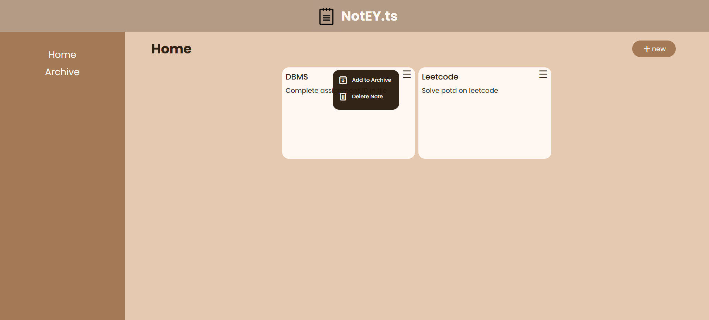

# NotEYdotTS

NotEYdotTS allows users to easily create new notes, delete unwanted ones, and archive those they wish to save for later. The application is designed with simplicity in mind, making it a perfect tool for everyday note management as well as a practice project for exploring TypeScript and OOP concepts.

## Project Interface

Below is a screenshot of the NotEY.TS application interface:

## Installation

To set up NotEYdotTS on your local machine, follow these steps:

### Clone the repository:

Open your terminal and run:
`git clone https://github.com/Gitax18/NotEYdotTS`

### Navigate to the project directory:

`cd NotEYdotTS`

### Install dependencies:

Run:
`npm install`

### Run the development server:

Start the server by running:
`npm run dev`

### Open your browser:

`Navigate to http://localhost:5173 (or the port specified by Vite) to view the application.`

## Future Plans

The following enhancements are planned for future updates:

- **Edit Functionality**: Enable users to modify existing notes.
- **User Authentication**: Implement secure user accounts for personalized note management.
- **Enhanced UI/UX**: Continuously improve the design and usability based on user feedback.

## Authors

### Gitanshu Sankhla

 

